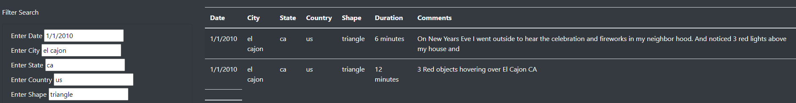
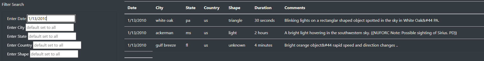

# UFOs
## Overview of UFO Analysis:
## The purpose:
Develop a webpage that includes an article summary, and interactive filters the end-user can manipulate to vizualize table data.

# Results:
Below are steps for using the interactive filters to search by Date, City, State, Country, Shape:
1. All **Filter Search** criteria start with the default set to all (data).  
2. Any or all of the **Filter Search** criteria can be used.
3. Using the full table of data, scroll to view available search criteria within the respective headings/columns. 
4. Click in the respective search cell and type search criteria - type over the text "default set to all".
 Example of **Filter Search** with all filtered:
 
 
 Example of **Filter Search** with one filtered:
  
 
There is a description of how to perform a search, with images. (4 pt)
# Summary:
1.  The summary addresses one drawback of this webpage (2 pt)
2.  Additional recommendations:
    - 1. 
    - 2. for further development (4 pt)
